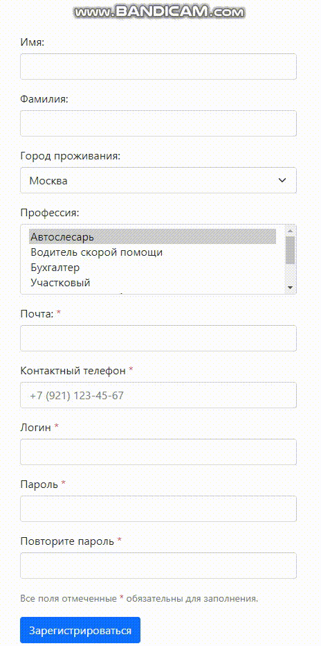

# Форма валидации на Vue
### Используемые технологии: 
#### *Bootstrap 4 | Vuelidate | vue-imask*


## Установка проекта
___
npm install


### Запуск проекта в режиме разработки
```
npm run serve
```

### Компилирует и минимизирует для продакшина
```
npm run build
```

### Запуск ESLint
```
npm run lint
```

### Customize configuration
See [Configuration Reference](https://cli.vuejs.org/config/).
